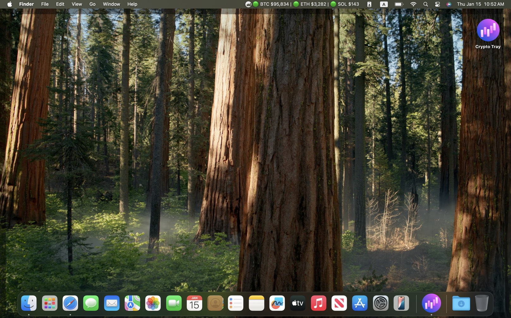

# CryptoTray

A lightweight cryptocurrency price tracker that lives in your system tray.

## Screenshot



> Note: System tray / menu bar behavior differs by OS and desktop environment.
> Some platforms may truncate or not show the dynamic title text next to the icon.
> If you don’t see prices in the tray, hover for the tooltip and use the tray menu items instead.

## Features

- Real-time cryptocurrency price updates in system tray
- Support for multiple crypto providers
- Customizable refresh intervals
- Multiple fiat currency support
- Start on system startup
- Cross-platform: Windows, macOS, Linux

## Providers

Currently supported providers:
- `Binance` (USDT pairs)
- `CoinGecko` (coin IDs; optional demo API key supported)

## Usage

- Launch the app, then use the tray icon menu:
  - `Open Settings` to configure provider, symbols, refresh interval, display currency, and autostart
  - `Refresh Now` to fetch the latest prices immediately
- Defaults:
  - Provider: `Binance`
  - Symbols: `BTCUSDT`, `ETHUSDT`, `SOLUSDT`
  - Refresh: `15s`
  - Display currency: `USD`

## Requirements

- Node.js 20+
- pnpm 9+
- Rust toolchain (stable)

### Linux system deps

On Ubuntu/Debian:

```bash
sudo apt-get install -y \
  libgtk-3-dev \
  libwebkit2gtk-4.1-dev \
  libayatana-appindicator3-dev \
  librsvg2-dev \
  build-essential \
  pkg-config
```

## Development

```bash
pnpm install
pnpm tauri dev
```

For quick UI iteration (frontend only):

```bash
pnpm dev
```

## Building

```bash
pnpm tauri build
```

## License

[MIT License](LICENSE)
